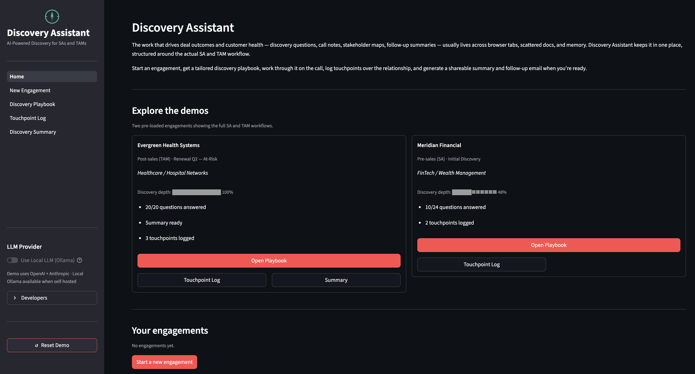

# Discovery Assistant

AI-powered customer engagement tool for Solutions Architects and Technical Account Managers.

Paste in customer context, get a tailored discovery playbook, work through it on the call, log touchpoints, and generate a shareable summary and follow-up email — in one workflow.

**[Try the live demo →](https://discovery-assistant.streamlit.app)**

> **Note:** Hosted on Streamlit's free tier — the app sleeps after a period of inactivity. If you see a "This app has gone to sleep" screen, click the wake-up button and allow 30–60 seconds to start.



---

## Why I built this

I've spent time as a TAM and observed a consistent friction point: the work that actually drives deal outcomes and customer health — discovery questions, call notes, stakeholder maps, follow-up summaries — lives across browser tabs, scattered Notion docs, and memory. CRM captures what happened after the fact. Nothing structures the conversation before and during it.

This is a portfolio project targeting Solutions Architect and pre-sales engineering roles. It's meant to demonstrate both domain fluency (what SA and TAM workflows actually look like) and technical depth (how to build a usable AI-powered tool around them).

Two demo engagements are pre-loaded to show the full workflow without any setup: a pre-sales SA discovery in progress (Meridian Financial), and a post-sales TAM renewal at-risk recovery with a completed summary (Evergreen Health Systems).

---

## Workflow

**1. New Engagement** — input customer context (company, industry, use case, tech stack, stage, notes). The LLM generates a categorized question bank tailored to that specific context and mode.

**2. Discovery Playbook** — work through questions during the call. Check off what's been asked, capture notes inline, promote AI-suggested follow-up probes directly into the bank. Edit or delete questions. Refresh with additional AI questions without touching answered ones. Edit context mid-engagement and choose to regenerate unanswered questions or append net-new ones.

**3. Touchpoint Log** — log meetings, calls, and QBRs with date, attendees, and notes. Full timeline sorted newest-first.

**4. Discovery Summary** — after the call, generate an AI-synthesized summary: key findings, technical requirements, risks, and recommended next steps. Edit any section inline before sharing. Export as markdown.

**5. Follow-up Email** — draft a ready-to-send post-call email from the summary. Editable, persistent, auto-cleared if the summary is edited.

**Discovery depth score** — Each engagement card shows a composite depth score (0–100%) answering "how well do I actually understand this customer?" — separate from how many questions have been marked asked. Weights: notes written on questions (60%), categories with at least one answer (20%), touchpoints logged (10%), summary exists (10%). The goal is a signal that reflects genuine discovery quality, not just checkbox activity. Formula lives in `Session.discovery_depth()` in `data/models.py`.

---

## Architecture

```
LLM Router → Ollama (local, free)           ← development / zero API cost
           → GPT-5.4-nano (OpenAI API)      ← question generation (high volume, structured)
           → Claude Haiku 4.5 (Anthropic)   ← summaries and email (quality-sensitive)
```

**LLM routing** — Two providers, routed by a `quality_required` flag. Question generation uses GPT-5.4-nano (high volume, structured output, cost-sensitive). Summaries and email drafts use Claude Haiku (higher quality, lower frequency). A local Ollama path (`USE_LOCAL_LLM=true`) runs everything through llama3.1:8b for zero API cost during development.

**Structured output with Ollama** — Local models struggle with Pydantic's raw JSON schema (`$defs`/`$ref` format) — llama3.1:8b would echo the schema definition back instead of returning data. The fix: a `_schema_to_example()` method that walks the schema and produces a clean example JSON object (`{"questions": [{"category": "...", "text": "...", "follow_ups": ["..."]}]}`). This is injected into the system prompt as a concrete format example rather than an abstract schema.

**Data model** — Single `Session` object is the source of truth for everything — context, questions, meetings, summary, email draft. Persisted as JSON via Pydantic's model serialization. No database; file-based storage keeps the local dev experience zero-config and makes the data inspectable. The `Session` model handles backward compatibility for fields added over time (all new fields have defaults).

**Streamlit patterns:**
- `st.session_state` carries `active_session_id` across page navigation so the engagement selector pre-selects correctly on every page
- `on_change` callbacks on question checkboxes and note textareas clear the "new question" highlight set on first interaction without a full rerun cycle
- `st.components.v1.html` with `window.parent.document.getElementById` triggers smooth scroll to newly promoted follow-up questions across the iframe boundary
- Inline question editing uses a session_state set (`editing_question_ids`) to toggle between view and edit mode within the same render pass

**Testing** — 58 tests, all LLM calls mocked via `unittest.mock.patch`. Tests cover model behavior, JSON serialization roundtrips, session persistence, question generation logic, summary generation, email generation, archive/restore, and discovery depth scoring. The goal is testing behavior (what the function returns given input) rather than implementation (how it calls the LLM).

**On the persistence model** — I used flat JSON files rather than a database deliberately. For a single-user portfolio tool it keeps setup to `git clone` and `pip install`, the data is directly inspectable, and Pydantic handles all serialization cleanly. The tradeoff I'm making is obvious: no concurrent access, no transactions, no query capability. In a production context I'd swap in SQLite for a single-user local tool or Postgres for multi-user, add proper auth, and move LLM generation to a background job queue so the UI isn't blocked during generation. The architecture is designed so that swap is contained — `data/store.py` is the only layer that touches the filesystem, and nothing else assumes file-based storage.

---

## Stack

Python · Streamlit · Pydantic v2 · OpenAI GPT-5.4-nano · Anthropic Claude Haiku 4.5 · Ollama

---

## Setup

Requires Python 3.10+.

```bash
git clone https://github.com/alexjustdoit/discovery-assistant.git
cd discovery-assistant
cp .env.example .env    # add API keys
python3 -m venv venv && source venv/bin/activate
pip install -r requirements.txt
streamlit run app/streamlit_app.py
```

Open `http://localhost:8502`. Two demo engagements load automatically.

**Windows:** replace `cp` with `copy` and `source venv/bin/activate` with `venv\Scripts\activate`.

**Environment variables** (in `.env`):

```
USE_LOCAL_LLM=true          # true = Ollama (free), false = OpenAI + Claude API
OPENAI_API_KEY=             # required if USE_LOCAL_LLM=false
ANTHROPIC_API_KEY=          # optional — enables Claude Haiku for summaries/email
OLLAMA_BASE_URL=http://localhost:11434
```

**Streamlit Cloud:** fork the repo, set main file to `app/streamlit_app.py`, and add keys under Settings → Secrets.

---

## Tests

```bash
pytest tests/ -v
```

58 tests covering models, persistence, question/summary/email generation, archive/restore, discovery depth scoring, and session management.

## Project Structure

```
discovery-assistant/
├── app/
│   ├── streamlit_app.py        # entry point and navigation
│   ├── components/             # sidebar header/footer
│   └── pages/                  # Home, New Engagement, Discovery Playbook,
│                               # Touchpoint Log, Discovery Summary, Technical Info
├── features/                   # question_generation, summary_generation, email_generation
├── llm/
│   ├── router.py               # USE_LOCAL_LLM routing + quality_required logic
│   └── providers/              # OllamaProvider, OpenAIProvider, ClaudeProvider
├── data/
│   ├── models.py               # Session, DiscoveryQuestion, Meeting, Summary (Pydantic)
│   ├── store.py                # file-based persistence; only layer touching the filesystem
│   └── sessions/               # persisted session JSON files
└── tests/                      # pytest suite (45 tests, LLM calls mocked)
```
